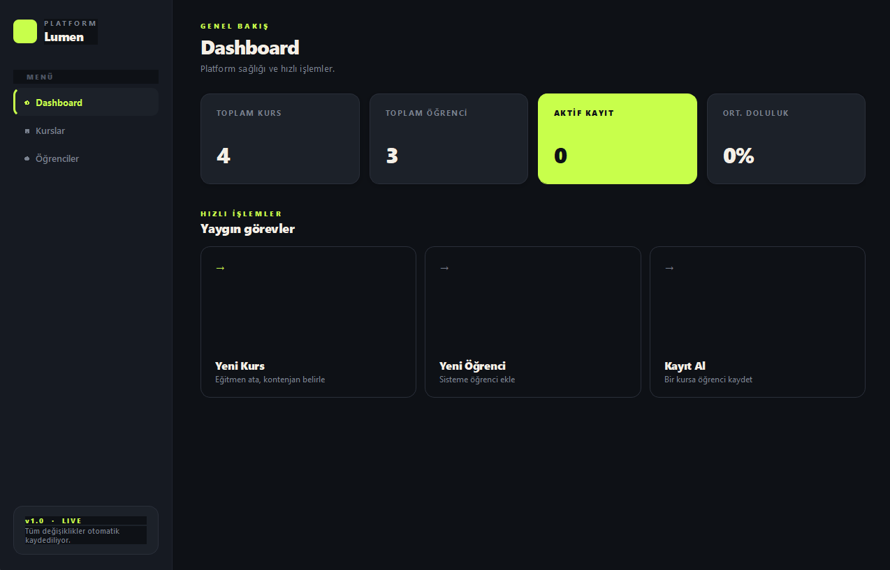
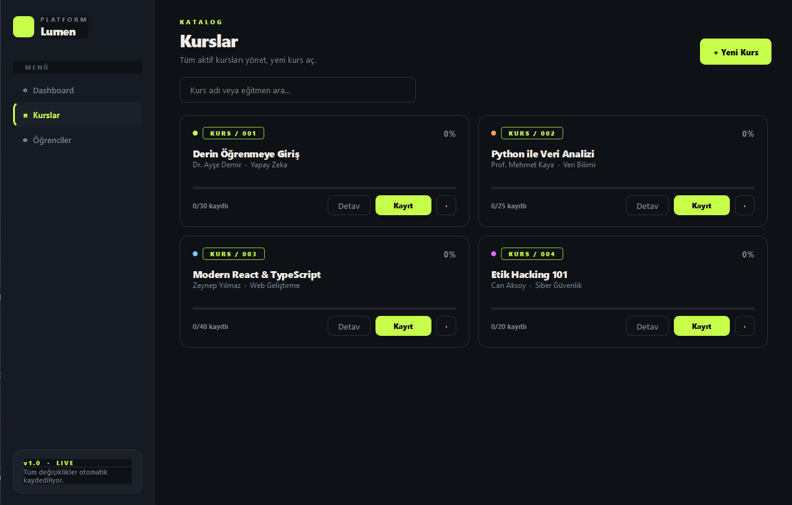
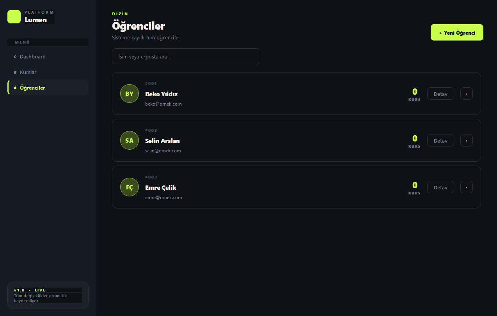

# Lumen - Online Kurs Platformu

Kurs ve egitmen tanimlama, ogrenci kaydi ve kurs kontenjan yonetimi icin gelistirilmis masaustu uygulamasidir. PyQt5 ile koyu temali, electric lime accentli modern bir arayuz sunar.

## Teknolojiler

- **Python 3** - Programlama dili
- **PyQt5 (>=5.15.0)** - Masaustu GUI framework
- **JSON** - Veri kaliciligi

## Proje Yapisi

    Lumen - Online Kurs Platformu/
    ├── main.py                          # Ana giris noktasi
    ├── backend/
    │   ├── models.py                    # Kurs, Ogrenci, Egitmen siniflari
    │   └── service.py                   # PlatformService - veri yonetimi + JSON kaliciligi
    ├── frontend/
    │   ├── main_window.py              # Ana pencere (sidebar + sayfalar)
    │   ├── styles.py                    # Renk paleti + QSS stilleri
    │   ├── widgets.py                   # StatCard, KursCard, OgrenciCard
    │   └── dialogs.py                   # Yeni kayit / detay pencereleri
    ├── images/                          # Ekran goruntuleri
    └── data/
        └── platform.json                # Otomatik uretilir

## Ana Siniflar

### Egitmen (`backend/models.py`)

- **Ozellikler:** `ad`, `uzmanlik`

### Ogrenci (`backend/models.py`)

- **Ozellikler:** `ogrenci_id`, `ad`, `email`, `kayitli_kurslar`
- **Metodlar:** Kurs listesi filtreleme (ogrencinin kayitli oldugu kurslar)

### Kurs (`backend/models.py`)

- **Ozellikler:** `kurs_id`, `kurs_adi`, `egitmen`, `kontenjan`, `kayitli_ogrenciler`
- **Metodlar:** Ogrenci kaydetme (kontenjan ve mukerrer kayit kontrolu)

## Ozellikler

- **Dashboard:** 4 metrik (Toplam Kurs, Ogrenci, Aktif Kayit, Ortalama Doluluk) + populer kurslar listesi
- **Kurslar:** 2 sutunlu kart grid'i, her kart icin doluluk bari, arama, ekleme/silme/detay
- **Ogrenciler:** Bas harfli avatarli kart listesi, kurs sayisi gostergesi, arama
- **Kayit Akisi:** Bir kursa ogrenci kaydetme; kontenjan dolduysa veya mukerrer kayitta uyari
- **Otomatik Kalicilik:** Her degisiklik aninda JSON'a yazilir
- **Tasarim:** Koyu tema (siyah arkaplan) + electric lime accent (#c5ff00) + sade tipografi

## Ekran Goruntuleri

### Kontrol Merkezi

### Kurslar

### Ogrenciler

## Kurulum ve Calistirma

    pip install PyQt5
    python main.py

## Ornek Veri

Ilk acilista `data/platform.json` ornek verilerle otomatik olusturulur. Tum degisiklikler bu dosyaya otomatik kaydedilir.
